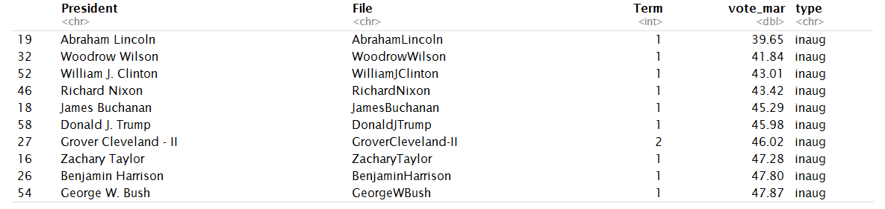
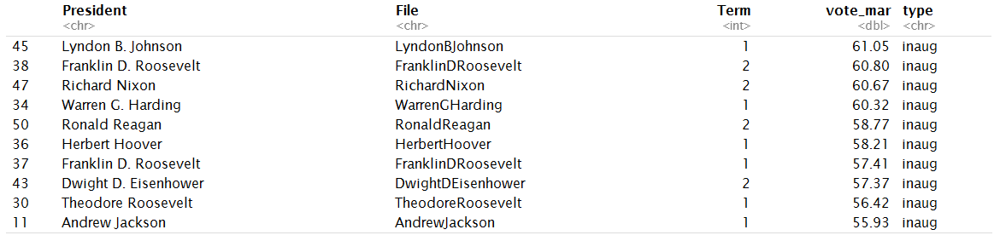
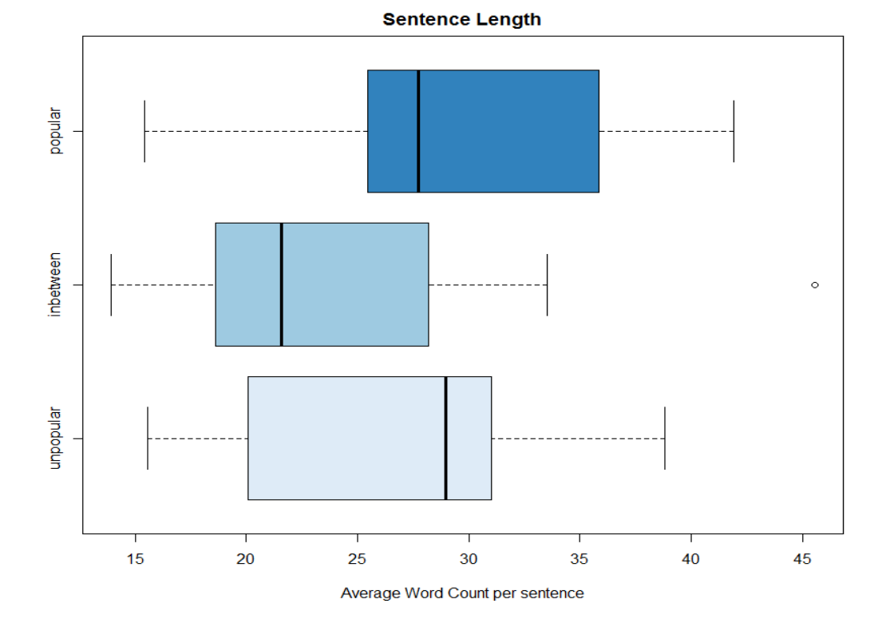
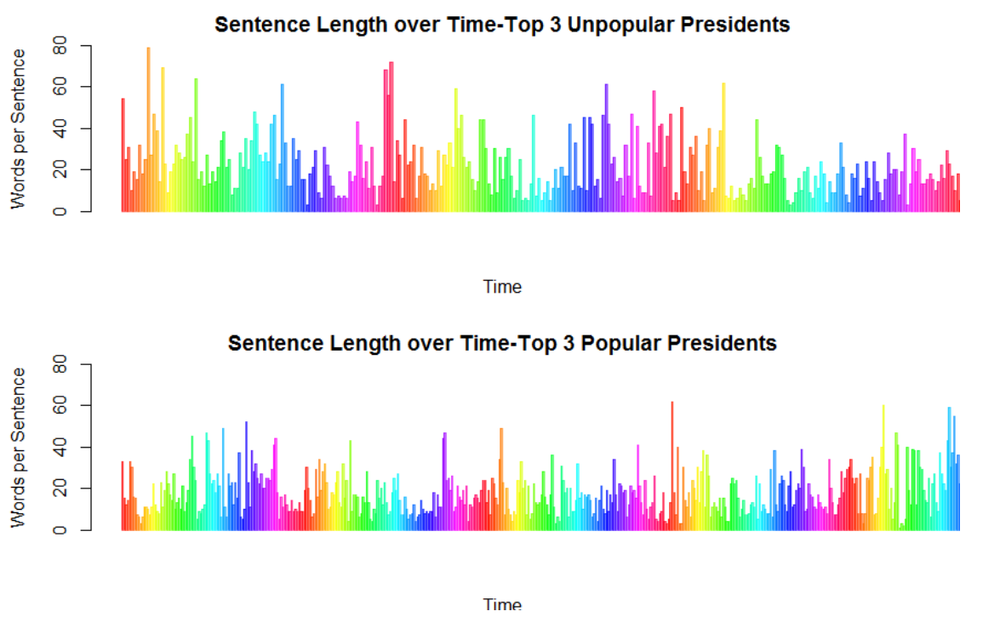
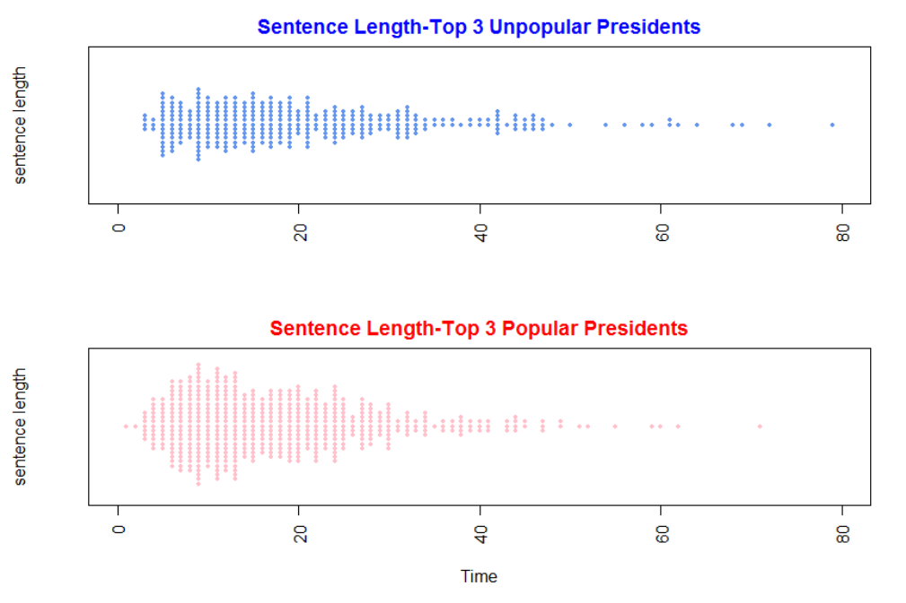
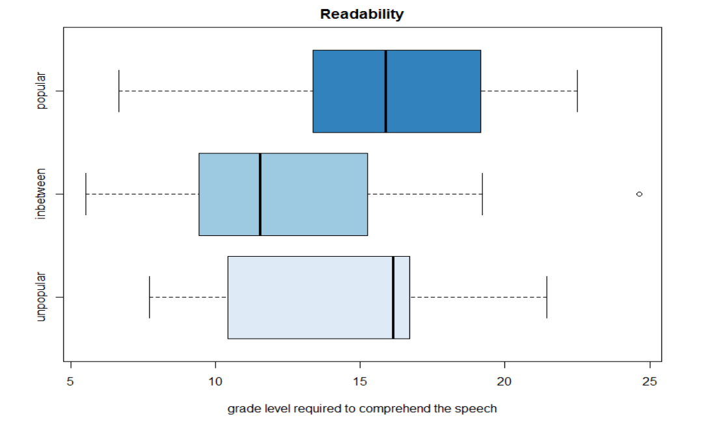
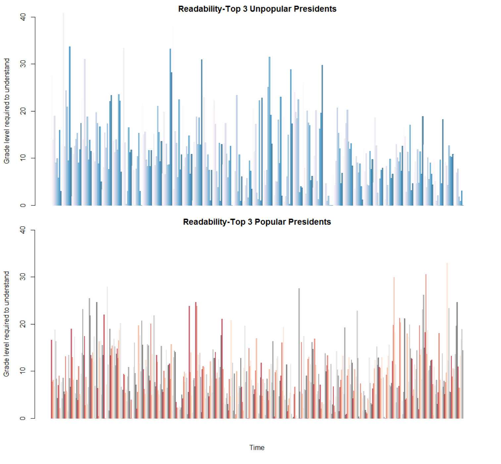
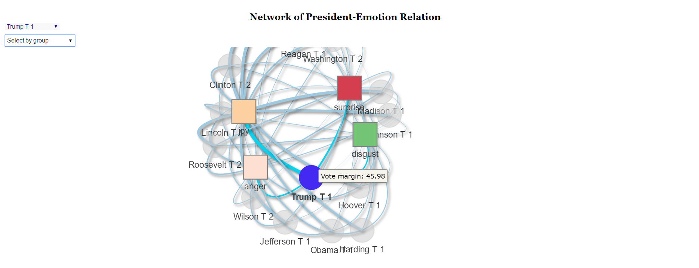
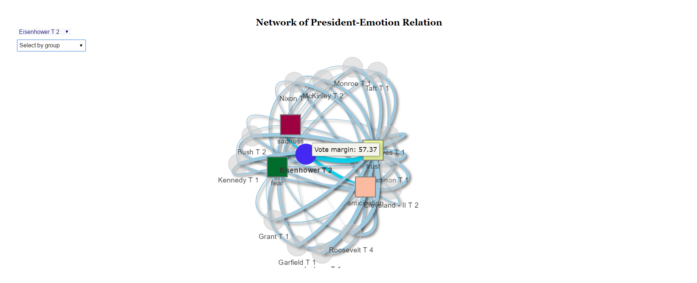
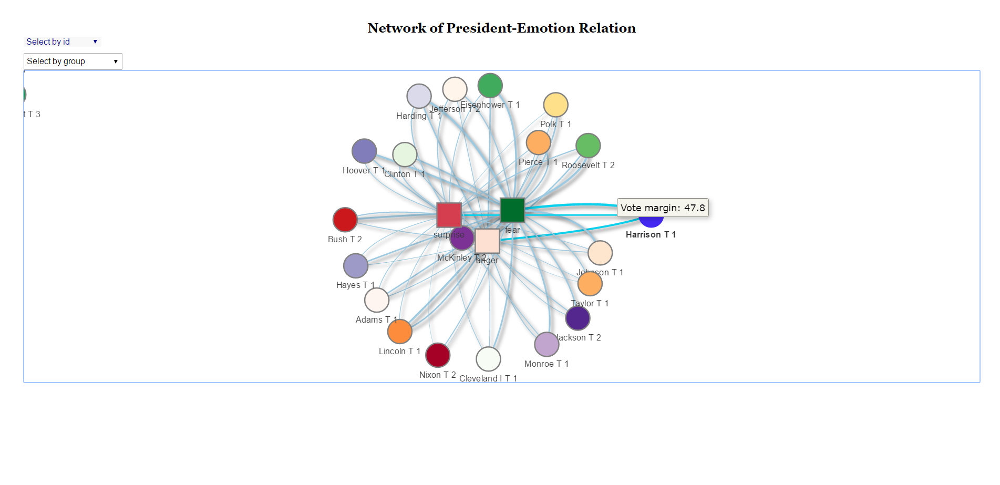

# Spring 2017
# Project 1: Does less popular presidents deliver better inaugural speech?


### [Project Description](doc/)
Inspiration:  
Having won the election by one of *the smallest popular vote margins* in history, my favorite U.S. president has always been John F. Kennedy. He had only *49.72%* of the popular vote.  But he's also remembered as a president who has delivered one of the most memorable and enduring inaugural speeches.

*Is popular vote margin related to U.S. president's performance in inaugural speech?* 
In other words, does pressure to win back the public's heart push U.S. presidents to deliver more comprehansible and admirable inaugural speeches? Let's find out.

+ Project title: Does less popular presidents deliver better inaugural speech?
+ This project is conducted by Ruxue Peng

+ Project summary: 
  I approach the question by first, quantify the concept of a "good" speech. Therefore, I calculated the sentene length of every inaugural speech and also calculatd *readability index* which tells how easy a text is for people to understand, by estimating the *grade level* required to understand it. Secondly, I quantified the concept of "popular" and "unpopular" presidents, grouping them by vote margin. At last, I visualized the relationship by standard EDA, wordcloud, sentiment analysis plus plotted a really cool *interactive network graph". 
 + Conclusion:
  * Unpopular presidents tried to be more comprehensible by making sentences shorter and spreading these easy sentences across their speeches
  * It takes as low as a high school junior student to understand "unpopular" presidents, but an average of higher to understand the "popular ones"
  * Even though individual "unpopular" president, like Trump, demostrated an intense emotion during his speech, this group as a whole does not differ much from the "popular" one in term of emotion level.
1. Grouping result (already-ordered)
* "unpopular" presidents are
  
* "popular" presidents are
  

2. Comparison by sentence length and readability
Unpopular presidents used short sentences and easy words and expressions, trying to be more comprehensible to the public, than the popular ones.  

2.1 Sentence Length
* boxplot  
  The mass of popular president's wordcount is generally bigger than the unpopular ones,meaning popular presidents made longer sentences.  
  
* Top 3 vs Top 3  
    Let us compare the top 3 president with least popular vote margin and the top 3 with the most, in terms for sentence length.  
    The three popular ones had short sentences in the beginning of the speech and got longer and longer as the speech went to an end, while the unpopular ones had short sentences spreaded out and mixed with the longer sentences.  

  
  

  
2.2 Readability  
    It takes as low as a high school Juior student (10th grade) to as high as undergraduate student to understand the unpopular presidents' speeches, but requires a person with bachelor's degree or above to understand the popular ones'.  
   
  

3. Sentiment Analysis
In the visualization of the 8 knids of emotions, I used *Interactive Network graph*.    
Making use of ["visNetwork" package](https://datastorm-open.github.io/visNetwork/) and some [related learning materials](http://kateto.net/network-visualization),I wrote a function myself ploting Network of Presidents and their speech emotions. 
* Overview of the output  
  Since the nodes and links are too much, I only used half of the data to generate this plot.  
  
  
3.1 Interactive Network visualization  
  I have change the plot to allow interaction.  
  I created a public website to allow you play with it: *www.ruxuepeng.tech*  
  
4. Interesting Findings from the plot  
  *For unpopular president candidates like Donald Trump (losing on popular vote), emotions are more to the intensive side,such as "Joy" and "Disgust.  
  
  
  *Popular presidents like Eisenhower at his second term, tend to have more steady emotion scores.
    
  
  *Even though individual "unpopular" president, like Trump, demostrated an intense emotion during his speech, this group as a whole does not differ much from the "popular" one in term of emotion level.

  
Some ideas on how you may interact with it
* drag the graph to center your desirable node point, zoom in, click on it
* drag the point to get a clear view of the connections between president and their emotions during speech
    
    
* use the "selection by id" bar on the topleft corner to highlight the president or emotion you want to observe
* use the "selection by group" bar on the left to observe "unpopular" group data with "popular" group data
* try creating your own cool graph by refering to the "Network_flora.R" function file in lib folder
  
Have fun!


Following [suggestions](http://nicercode.github.io/blog/2013-04-05-projects/) by [RICH FITZJOHN](http://nicercode.github.io/about/#Team) (@richfitz). This folder is orgarnized as follows.

```
proj/
├── lib/
├── data/
├── doc/
├── figs/
└── output/
```
To reproduce the result:
Please see each subfolder for a README file.
*Before you start, please clone/download this entire project folder and set R/Rstudio working directory at the Doc folder of this project*

Further Learning Materials:
[Web Scrapping](http://francojc.github.io/web-scraping-with-rvest/)  

[Selectorgadget](http://selectorgadget.com/)  

[NRC sentiment lexion](http://saifmohammad.com/WebPages/NRC-Emotion-Lexicon.htm)  

[blog of Max Ghenis for Readability index](https://www.r-bloggers.com/statistics-meets-rhetoric-a-text-analysis-of-i-have-a-dream-in-r/)  

[Automated Readability Index](https://trinker.github.io/qdap/Readability.html)  

["visNetwork" package](https://datastorm-open.github.io/visNetwork/) and some [related learning materials](http://kateto.net/network-visualization)  

[Text Mining](https://rstudio-pubs-static.s3.amazonaws.com/31867_8236987cf0a8444e962ccd2aec46d9c3.html)  


*Thank you for reading this little story*, about how a girl solved her puzzle by rolling up her sleeves and digging in data science.  


