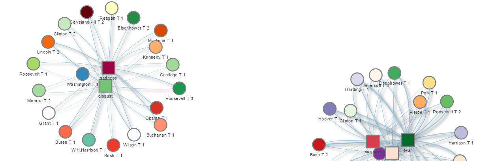

# Spring 2017
# Project 1: 



### [Project Description](doc/)
Inspiration:  
Having won the election by one of the smallest popular vote margins in history, my favorite U.S. president has always been John F. Kennedy. J.F.Kennedy had only 49.72% of the popular vote.  But he's also remembered as a president who has delivered on of the most memorable and enduring inaugural speeches.
Is popular vote margin related to presidents' performance in composing inaugural speeches? In other words, does pressure to win back the public's heart push U.S. presidents to deliver more comprehansible and admirable inaugural speeches?
To find out the answer to this question, this project has come into being.

+ Project title: Does less popular presidents deliver better inaugural speech?
+ This project is conducted by Ruxue Peng

+ Project summary: [a short summary] Lorem ipsum dolor sit amet, consectetur adipiscing elit, sed do eiusmod tempor incididunt ut labore et dolore magna aliqua. Ut enim ad minim veniam, quis nostrud exercitation ullamco laboris nisi ut aliquip ex ea commodo consequat. Duis aute irure dolor in reprehenderit in voluptate velit esse cillum dolore eu fugiat nulla pariatur. Excepteur sint occaecat cupidatat non proident, sunt in culpa qui officia deserunt mollit anim id est laborum.

Following [suggestions](http://nicercode.github.io/blog/2013-04-05-projects/) by [RICH FITZJOHN](http://nicercode.github.io/about/#Team) (@richfitz). This folder is orgarnized as follows.

```
proj/
├── lib/
├── data/
├── doc/
├── figs/
└── output/
```
To reproduce the result:
Please see each subfolder for a README file.
*Before you start, please clone/download this entire project folder and set working directory at the Doc folder of this project*
